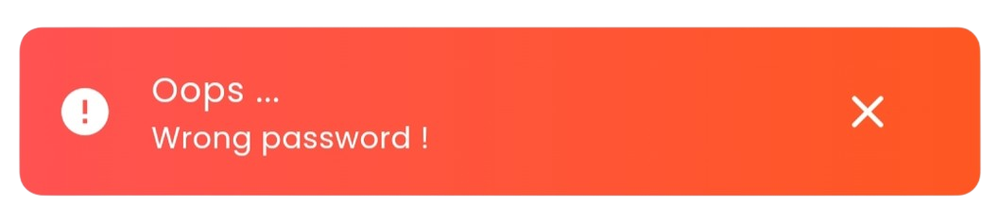
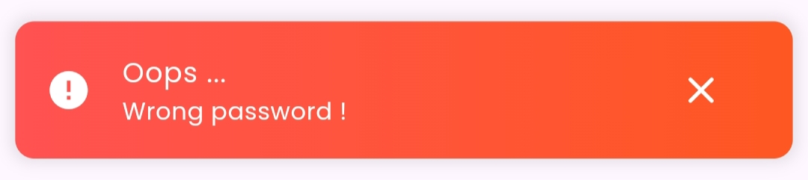

<!-- [](https://buymeacoffee.com/atanusabyasachi) -->
## Support Me

<a href="https://www.buymeacoffee.com/AtanuSabyasachi">
</a>

A simple and fancy `SnackBar` widget for Flutter that provides an easy way to display SnackBars with advanced customization options, such as background color, text style, and more.

## Features

- **Customizable SnackBar**: Fully customizable with options for background color, text style and more.
- **Snack Type**: Set the snack type for different purposes.
- **Display Duration**: Set the display duration of the Snackbar.
- **Persistent SnackBar**: Option to keep the Snackbar visible until manually dismissed.
- **Position**: Set the snackbar position on top or bottom.
- **Text-To-Speech**: Read the message aloud using text to speech configuration.

## Usage

To display a customized SnackBar, you can use the Snackify.show() method. Here's a breakdown of how to use it:

```dart
import 'package:flutter/material.dart';
import 'package:snackify/snackify.dart';

void showCustomSnackbar(BuildContext context) {
  Snackify.show(
    context: context,
    type: SnackType.success,
    message: "This is a custom Snackbar!",
    duration: Duration(seconds: 3),
    animationDuration: Duration(milliseconds: 500),
    backgroundGradient: LinearGradient(colors: [Colors.blue, Colors.purple]),
    position: SnackPosition.bottom,
    persistent: false, // Set to true to keep Snackbar visible until manually dismissed
  );
}
```

## SnackType

### Success


```dart
Snackify.show(
  type: SnackType.success,
  ///...
);
```
### Error



```dart
Snackify.show(
  type: SnackType.error,
  ///...
);
```

### Warning


```dart
Snackify.show(
  type: SnackType.warning,
  ///...
);
```
### Info


```dart
Snackify.show(
  type: SnackType.info,
  ///...
);
```
## Parameters

- **context**: The current BuildContext where the snackbar will be displayed.
- **type**: Specifies the type of the snackbar (SnackType.success, SnackType.error, SnackType.warning, SnackType.info, SnackType.custom)
- **title**: The title of the snackbar.
- **subtitle**: The subtitle text displayed below the title.
- **offset**: The offset from the top or bottom of the screen. Defaults to (0, 0).
- **delay**: A delay before the snackbar is shown.
- **duration**: How long the snackbar stays visible (default is 3 seconds).
- **animationDuration**: Duration of the entrance and exit animation.
- **backgroundGradient**: Custom gradient background for the snackbar.
- **position**: Position of the snackbar (default is SnackPosition.bottom, can also be SnackPosition.top).
- **snackShadow**: A list of shadow for the snack.
- **persistent**: Whether the snackbar should stay visible until manually dismissed (default is false).
- **action**: Optional custom widget to display as an action button in the snackbar.
- **ttsConfig**: Configuration for (Text-to-Speech) to activate snack message reading

## SnackType Configuration

Each SnackType has a default configuration, including colors, icons, text styles, and more. Here’s an example of a custom configuration

```dart
SnackTypeConfiguration customConfig = SnackTypeConfiguration(
  backgroundColor: Colors.black,
  icon: Icons.notifications,
  iconColor: Colors.white,
  title: Text('Custom Snackbar'),
  subtitle: Text('This is a custom snackbar with your settings.'),
  textStyle: TextStyle(color: Colors.white),
  elevation: 10.0,
  margin: EdgeInsets.all(12.0),
  borderRadius: BorderRadius.circular(16),
);
```

You can use this configuration when calling the Snackify.show() method by passing the configured parameters.

## Text-to-Speech (TTS) Integration
With the Text-to-Speech (TTS) feature, you can have the snackify messages read aloud when it appears on the screen.

To enable TTS, provide a TTSConfiguration object with the speakOnShow parameter set to true. Additionally, you can customize the language, speech rate, and pitch for the TTS.

Example:

```dart
Snackify.show(
  context: context,
  type: SnackType.info,
  message: "This is an informational Snackbar.",
  ttsConfig: TTSConfiguration(
    speakOnShow: true, // this will enable TTS
    language: 'en-US',
    speechRate: 0.5,
    pitch: 1.0,
  ),
);
```

## Dismissal Options

- **Tap Dismissal**: The Snackbar can be dismissed by tapping the close button.
- **Swipe Dismissal**: User can dismiss the snack by swiping horizontally.
- **Auto Dismissal**: The Snackbar can be automatically dismissed after a specified duration or when persistent is set to false.

## Persistent SnackBar

If you want a Snackbar to remain visible until manually dismissed, set the persistent property to true. This will prevent the Snackbar from being dismissed automatically after the set duration.

```dart 

Snackify.show(
  persistent: true, // Snackbar will not auto-dismiss
  ///...
);
```
## Conclusion

Snackify provides a powerful way to create highly customizable and stylish SnackBars in Flutter. With options like stacked snackbars, custom animations, persistent snackbars, and more, you can create a rich user experience with minimal effort.

For more details, check the `documentation`.

## Contributing

Contributions are welcome! Here is how you can help:

- Report bugs and request features via [GitHub Issues](https://github.com/Atanu-Sabyasachi/snackify/issues)
- Engage in discussions and help users solve their problems/questions in the [Discussions](https://github.com/discussions)

<!-- ## Sponsors

I develop this package in my free time. If you or your company benefits from this package, it would mean a lot to me if you considered supporting me on [GitHub Sponsors](https://github.com/sponsors/your_profile).

---

## Bronze Sponsors

<p align="center">
  
</p> -->

-------------------------------------------------------------

**Version**: 1.2.3  
**Author**: Atanu Sabyasachi Jena  
**License**: MIT
